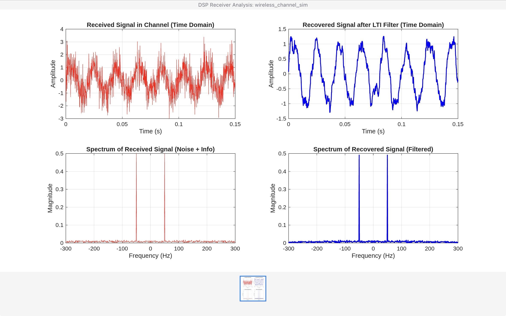

# Wireless Channel Simulator & Digital Signal Recovery (DSP)

A MATLAB-based implementation of a Digital Signal Processing (DSP) receiver pipeline. This project simulates baseband signal transmission over an Additive White Gaussian Noise (AWGN) wireless channel, recovers the signal using discrete-time convolution (LTI filtering), and validates system performance via Fast Fourier Transform (FFT) spectral analysis.

---

## Key DSP Concepts Implemented
- **Sampling Theorem & Nyquist Criteria**: Continuous-to-discrete conversion at $f_s = 8000\text{ Hz}$ to prevent spectral aliasing.
- **Wireless Channel Modeling**: Additive White Gaussian Noise (AWGN) representation of RF channel distortion.
- **LTI System & Discrete Convolution**: Moving-average FIR filter implementation ($h[n]$) using discrete convolution sum to eliminate high-frequency noise.
- **Spectral & Frequency Analysis**: FFT and magnitude spectrum visualization ($f$-domain vs $t$-domain comparison).

---

## System Output & Results

Below is the output generated by the MATLAB script comparing the received vs. recovered signals across time and frequency domains:

### Performance Analysis:
1. **Time Domain**: The LTI filter suppresses sharp AWGN noise fluctuations, smoothing the waveform back to its original sinusoidal structure.
2. **Frequency Domain**: FFT analysis demonstrates attenuation of the broad noise floor while preserving the fundamental spectral magnitude at $\pm 50\text{ Hz}$.

---

## How to Run
1. Open MATLAB.
2. Clone or download `wireless_channel_sim.m`.
3. Run the script to generate the 4-subplot receiver analysis figure.
